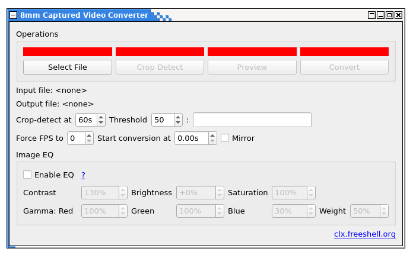

# super8-converter
This is a user friendly MPV front-end interface for post-processing (mostly cropping and compression) captured 8mm argentic films.

Under Linux, please `apt-get install mpv` or anything for having the binary mpv in the path. For windows, download it [here](https://sourceforge.net/projects/mpv-player-windows/files/) and place mpv.exe in the same directory than super8-converter.py, and it just should work.
